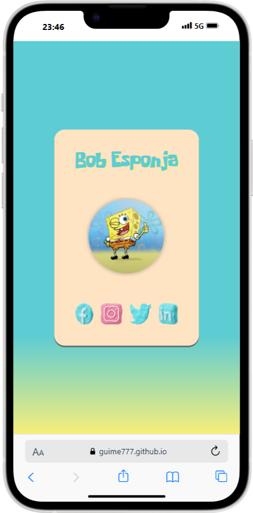
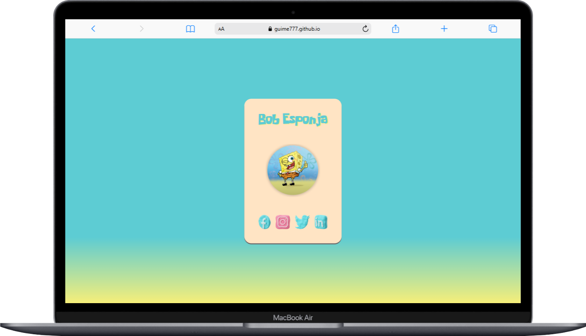

# Aprendendo git com o bob Esponja

o intuito deste repositorio e aprender as melhores praticas de versionamento de projeto atraves de tecnologia git agregado a plataforma de codigos github

## site proposto : Perfil Bob Esponja

- [x] Estrutura base html
- [x] Organizando arquitetura de projetos front
    - assets
        - img
         - fonts
- [x] Realizando primeito commit
- [x] Estilo inicial css
- [x] Realizando segundo commit
- [x] Enviando ao github

## Instruções GIT

| instrução | Descrição |
|-|-|
|git init | iniciar o monitoramento do projeto |
|git status | verificar o estado dos arquivos presentes|
|git add | Prepara os arquivos para uma nova versão|
|git commit -m "mensagem" | cria uma nova versao|
|git remote |verifica ou adiciona uma origem remota|
|git log | verifica os commits presentes|
|git clone | clona um repositorio remoto|
|git push | envia para o repositorio remoto a produção local|

## Instruções de configurações GIT

| instrução | Descrição |
|-|-|
|git config list | lista as configurações |
|git config --global user.name | configura o nome do usuario|
|git config --global user.email | configura o email do usuario|

# Blog Peixe

    
    
    

Site Desenvolvido em tecnologia HTML e CSS com responsividade presente em tablets e smartphone

[Acesse aqui](https://guime777.github.io/aulagit/)